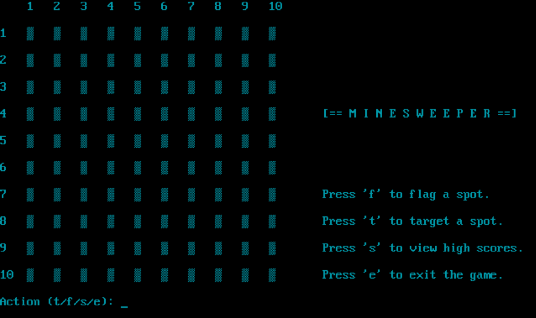
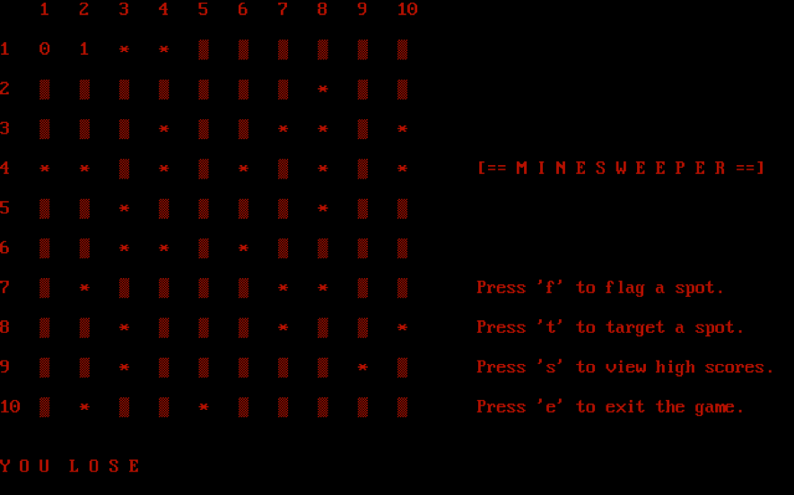
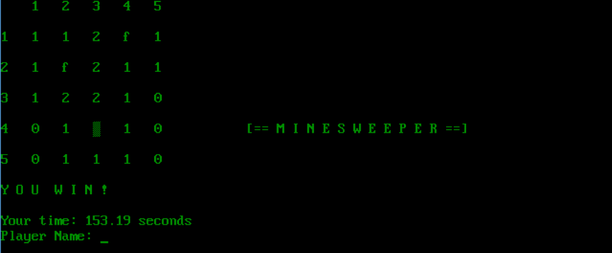
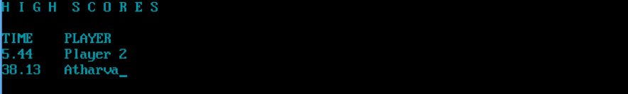

# Old School Minesweeper

Minesweeper (remember?) written in Object-Oriented C++98 in DOS for my grade 12 computer science class.

# How it works

Each Minesweeper game starts out with a grid of unmarked squares. After clicking one of these squares, some of the squares will have numbers on them. The user must use the numbers to find out which of the blank squares have mines and which are safe to target.  

The player wins after targeting all safe squares. The time taken to complete, along with the player’s username, will then be inserted into a data file as a class. The records of previous players can be viewed in the ‘High Scores’ screen, where they are sorted in descending order.  

There are 4 possible actions:
1.	**f:** Flag a spot
2.	**t:** Target a spot and reveal the square
3.	**s:** View all high scores from scores.dat
4.	**e:** exit game

Defeat:

Victory:

Leaderboard:

